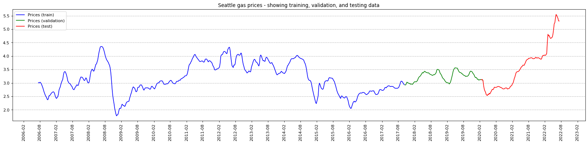
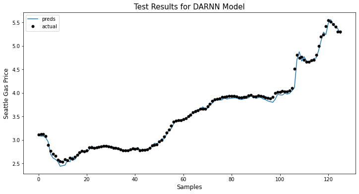
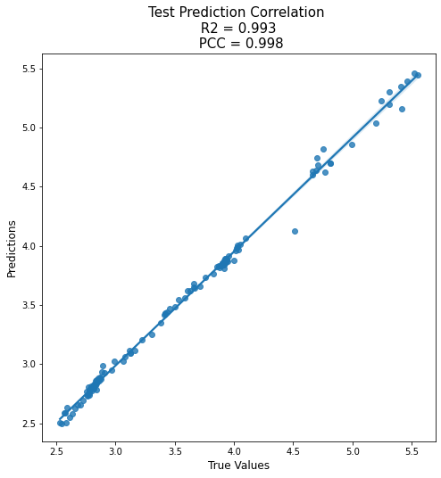
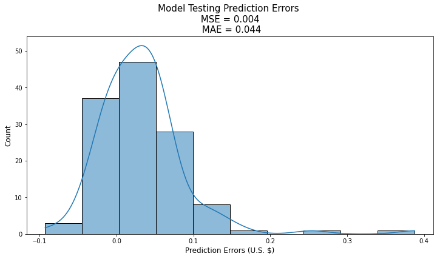
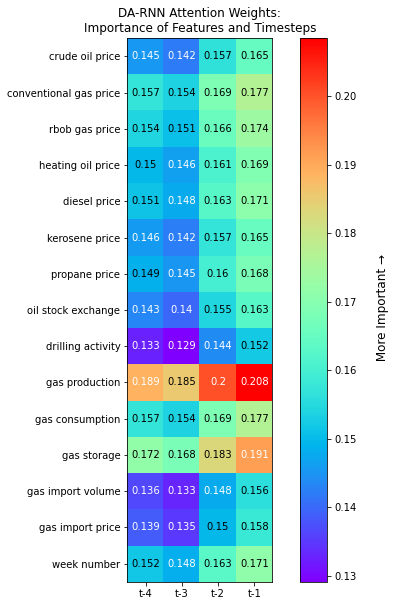
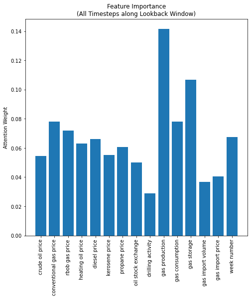
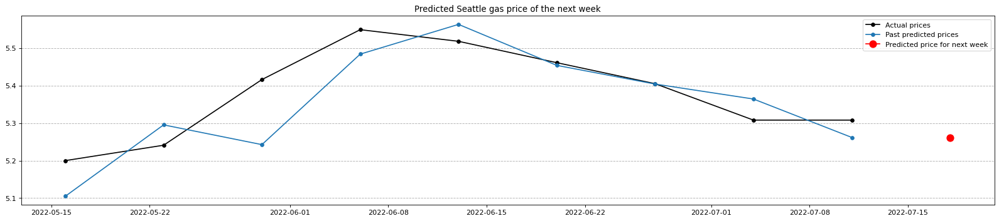

# :car::cloud_with_rain: Predicting Seattle Gas Prices using Machine Learning :chart_with_upwards_trend::chart_with_downwards_trend:

## Table of Contents <!-- omit in toc -->

- [Overview](#overview)
- [Installation](#installation)
- [Code Description](#code-description)
- [Model Comparisons](#model-comparisons)
- [To Do List](#to-do-list)
- [Credits](#credits)
- [License](#license)

## Overview

As of the summer of 2022, there has been a dramatic hike in the cost of retail gasoline. I live in Seattle, where the cost of living is already 53% higher than the national average, and I know a lot of individuals who have been hit especially hard due to higher energy costs. It would be very useful to find out if retail gas prices will increase, stay steady, or decrease a week in advance. Having access to this information may give some added flexibility to household budgets, particularly for those who have a large share of their income going toward essential costs such as transportation, housing, and food.

In this project, I went through an end-to-end data science/machine learning workflow to create accurate models that predict retail gas prices in Seattle a week in advance. Two different types of forecasting techniques, time series and deep learning algorithms, were used for model development. For time series modeling, [Facebook Prophet](https://facebook.github.io/prophet/) and [NeuralProphet](https://github.com/ourownstory/neural_prophet) models were implemented. For deep learning modeling, [Long Short-Term Memory (LSTM)](https://en.wikipedia.org/wiki/Long_short-term_memory), [Dual-stage Attention-based Recurrent Neural Network (DA-RNN)](https://arxiv.org/abs/1704.02971), and [Hierarchical attention-based Recurrent-Highway-Network (HRHN)](https://arxiv.org/abs/1806.00685) models were implemented. The models were trained using time series data from the [U.S. Energy Information Administration](https://www.eia.gov/) and the deep learning models were built using the [PyTorch](https://pytorch.org/) framework.

The machine learning (ML) workflow presented in this project goes through the following steps:

  1. [Source the time series data](#source-the-data)
  2. [Prepare the data for model training](#prepare-the-data)
  3. [Develop the models](#develop-the-models)
  4. [Train and evaluate the models using the prepared data](#train-and-evaluate-the-models)
  5. [Get future predictions (i.e., forecasts) from the models](#predict-the-future)

All these steps are included in the provided Jupyter Notebook. Neural network architecture classes and functions (train, evaluate, forecast) are provided in separate Python files within the directory.

All ready? Let's get to it!

## Installation
- Download this repository and move it to your desired working directory
- Download Anaconda if you haven't already
- Open the Anaconda Prompt
- Navigate to your working directory using the cd command
- Run the following command in the Anaconda prompt:
  
	```
  	conda env create --name NAME --file environment.yml
  	```

	where NAME needs to be changed to the name of the conda virtual environment for this project. This environment contains all the package installations and dependencies for this project.
  
- Run the following command in the Anaconda prompt:

  	```
  	conda activate NAME
  	```

	This activates the conda environment containing all the required packages and their versions.
  
- **For Jupyter Notebook Web Interface users:**
    - Open Anaconda Navigator
    - Under the "Applications On" dropdown menu, select the newly created conda environment
    - Install and open Jupyter Notebook. NOTE: once you complete this step and if you're on a Windows device, you can call the installed version of Jupyter Notebook within the conda environment directly from the start menu.  
    - Navigate to the Natural_Gas_Stock_Forecast.ipynb file within the repository
- **For VS Code users:**
    - [Install the Python extension](https://code.visualstudio.com/docs/python/python-tutorial) if you haven't already
    - Open the Command Palette (Ctrl+Shift+P)
    - Type *Python: Select Interpreter*
    - Select the newly-created Conda environment
    - Open Natural_Gas_Stock_Forecast.ipynb
    - Look at the top right
        - If you see the name of the Conda environment, you're done!
        - If you see a "Select Kernel" button, press it and select the Conda environment

## Code Description

This section goes over the essential tasks of the end-to-end ML pipeline. Code snippets are embedded inline.

### Source the Data

Before we can predict future gas prices, we'll need to acquire the historical time series data to train our models. For this, we will write Python code that downloads CSV files from [eia.gov](https://www.eia.gov/) and stores the data as variables. This way we won't have to worry about updating local CSV files on our machine with the most recent data. Instead, EIA does this for us. Thanks, government!

The following function uses the link address from EIA to download the CSV, parse through the data, and format the time series data as a Pandas DataFrame.

<details>
<summary>View code</summary>

```python
def download_data(url, name='', usecols=None, sheet_name=1, header=2, plot=False): 
    global config
    
    r = requests.get(url)
    open('temp.xls', 'wb').write(r.content)
    df = pd.read_excel('temp.xls', sheet_name=sheet_name, header=header, usecols=usecols) 
    df = df[~df.isnull().any(axis=1)] # remove rows with any missing data
       
    num_data_points = len(df)
    
    df2 = df.iloc[[0, -1]]    
    date_range = "from " + str(df2.iloc[0,0]) + " to " + str(df2.iloc[1,0])
    print(date_range, str(num_data_points) + ' Data Points')
    
    data_dict = {}
    data_dict['data'] = df.rename(columns={df.keys()[0]: 'date', 
                            df.keys()[1]: name})
    data_dict['num elements'] = num_data_points
    data_dict['date range'] = date_range
    data_dict['name'] = df.keys()[1]
    
    if plot:
        fig = figure(figsize=(25, 5), dpi=80)
        fig.patch.set_facecolor((1.0, 1.0, 1.0))
        plt.plot(data_dict['data']['date'], data_dict['data'][name], color=config["plots"]["color_actual"])
        plt.title(data_dict['name'] + ", " + data_dict['date range'] + ", " + str(data_dict['num elements']) + " Data Points")

        # Format the x axis
        locator = mdate.MonthLocator(interval=config["plots"]["xticks_interval"])
        fmt = mdate.DateFormatter('%Y-%m')
        X = plt.gca().xaxis
        X.set_major_locator(locator)
        # Specify formatter
        X.set_major_formatter(fmt)
        plt.xticks(rotation='vertical')
        plt.xlim([data_dict['data'].iloc[0,0], data_dict['data'].iloc[-1,0]])

        plt.grid(visible=None, which='major', axis='y', linestyle='--')
        plt.show()
         
    return data_dict
```
</details>

[Weekly Seattle retail gas price data (dollars/gallon)](https://www.eia.gov/dnav/pet/hist/LeafHandler.ashx?n=PET&s=EMM_EPMRU_PTE_Y48SE_DPG&f=W) is used as the target variable, which is the variable whose values we will model and predict. A feature variable is a variable whose values will be used to help predict the future value of the target variable. Note that the time series models (Prophet and NeuralProphet) use the historical values of the target variable as their only feature variable. The reason for this is that these are univariate models. In other words, they are able to forecast long-term behavior using recursion but the trade-off is that they can only deal with one time series. Univariate models do not utilize feature variables since they do not have access to their future values and as a results. The prediction accuracy of these models may be limited since there exist a large number of other time series that could affect retail gas prices and could help provide insights to our predictions.

ML models are able to use feature variables as regressors, even if we do not have access to their future values. As long as we choose good external predictors as feature variables, we can expect the predictive performance of ML models to be superior to time series models. The downside is that we are only able to output predicted target variable values based on the horizon that we train it on (e.g., we train the ML model to predict gas prices a week into the future). You can build a predictive model for each feature but keep in mind that using predicted values as features will propagate the error to the target variable. The features that were chosen for this project are as follows:

- U.S. Crude Oil Stock Change (Thousands Barrels)
- U.S. Natural Gas Rotary Rigs in Operation (Number of Elements)
- U.S. Natural Gas Production (Million Cubic Feet)
- U.S. Natural Gas Consumption (Million Cubic Feet)
- U.S. Underground Natural Gas Storage Capacity (Capacity in Million Cubic Feet)
- U.S. Natural Gas Import Volumes (Million Cubic Feet)
- U.S. Natural Gas Import Prices (Dollars/Thousand Cubic Feet)
- Henry Hub Natural Gas Spot Price (Dollars/Million Btu)
- U.S. Crude Oil Spot Price (Dollars/Barrel)
- U.S. Conventional Gasoline Price (Dollars/Gallon)
- U.S. RBOB Regular Gasoline Price (Dollars/Gallon)
- U.S. Heating Oil Price (Dollars/Gallon)
- U.S. Ultra-Low-Sulfur No. 2 Diesel Fuel Price (Dollars/Gallon)
- U.S. Kerosene-Type Jet Fuel Price (Dollars/Gallon)
- U.S. Propane Price (Dollars/Gallon)

Note that other relevant factors can be included as feature variables! This project can be expanded on by including data exploration pipelines. For instance, studying the correlation between variables may be insightful. Furthermore, studying the behavior of variables in response to significant events (e.g., natural disasters, war, pandemics, recessions, etc.) may allow us choose features that can best help our models make accurate predictions during periods of sudden change.

### Prepare the Data

Now that our program has downloaded the data, the next step is to prepare it for model training. The first step is to add another dimension to the time series data. Within this dimension we will add sequences containing a sequence of the past 8 weeks of the time series values. This method is called the rolling window method (sometimes called the lag method in statistics) and the window is different for every data point. Here is a great gif that demonstrates this method:


Note that we will implement a rolling window on the target variable as well as all the feature variables. In practice, choosing a window length appropriate to the temporal dependencies of the problem greatly simplifies training and performance of the network. Too short of a window length increases the chance that the model parameter estimates do not produce high-fidelity predictions. On the other hand, too long of a window length increases the chance that you are trying to stretch your model to cover more cases than it can accurately represent. For this application, including sequences up to 8 weeks into the past seems to work well.

<details>
<summary>View code</summary>

```python
timesteps = 8 # lookback window

# Preallocate feature and target arrays
X_ = np.zeros((len(data), timesteps, data.shape[1]-1))
y_ = np.zeros((len(data), timesteps, 1))

# Feature Variables
for i, name in enumerate(list(data.columns[:-1])):
    for j in range(timesteps):
        X_[:, j, i] = data[name].shift(timesteps - j - 1).fillna(method="bfill")

# Historical Target Variable Values
for j in range(timesteps):
    y_[:, j, 0] = data[target_name].shift(timesteps - j - 1).fillna(method="bfill")

# Target Variables
prediction_horizon = 1
target_ = data[target_name].shift(-prediction_horizon).fillna(method="ffill").values
```
</details>

After transforming the dataset, the shape of our feature variable array `X_` is `(835, 8, 15)`, where the first dimension represents the 835 datapoints (i.e., timesteps), the second dimension represents the 8 historical values at each datapoint, and the third dimension represents the particular time series for each of the 15 feature variables. Note that the historical target variable values are kept separate in the `y_` array. The target variable values at each of the 835 datapoints are stored in the `target_` variable.

The next step is to split the dataset into three parts: training, validation, and testing. The training dataset is used to train the model and adjust its parameters. In other words, the model sees and learns from this data. The validation dataset is used to periodically evaluate the model during training. The models "see" this data, but they never learn from it. This dataset provides an unbiased evaluation of the model fit on the training dataset while tuning model hyperparameters. It is also useful for implementing callbacks such as early stopping and learning rate schedulers, which can help prevent overfitting. The test dataset is used to provide an unbiased evaluation of the final model fit on the training dataset. It is only used once the models are completely trained and let's us compare the performance of competing models. I split the data into a 70-15-15 split where 70% of the data is used for training, the next 15% used for validation, and the remaining 15% for testing.

<details>
<summary>View code</summary>

```python
# Dataset indices
up_to_train_idx = int(data.shape[0]*0.70)
up_to_val_idx = int(data.shape[0]*0.85)

# Number of data points in each dataset
train_length = up_to_train_idx
val_length = up_to_val_idx - up_to_train_idx
test_length = data.shape[0] - train_length - val_length

print(train_length, val_length, test_length)

X = X_[timesteps:]
y = y_[timesteps:]
target = target_[timesteps:]

X_train = X[:train_length]
y_his_train = y[:train_length]
X_val = X[train_length:train_length+val_length]
y_his_val = y[train_length:train_length+val_length]
X_test = X[-val_length:]
y_his_test = y[-val_length:]
target_train = target[:train_length]
target_val = target[train_length:train_length+val_length]
target_test = target[-val_length:]
```
</details>



The next data preparation step is to normalize the time series data. Since we are dealing with a number of feature variables with different units and a wide range of magnitudes, it is important that no single variable steers the model behavior in a particular direction just biggest it contains bigger numbers. The goal of normalization is to change the values of all the time series to a common scale, without distorting the differences in the shape of each time series. To normalize the machine learning model, values are shifted and rescaled so their range can vary between 0 and 1.

<details>
<summary>View code</summary>

```python
class Normalizer():
    def __init__(self):
        self.max = None
        self.min = None
        self.range = None

    def fit_transform(self, x):
        self.max = x.max(axis=0)
        self.min = x.min(axis=0)
        self.range = self.max - self.min
        normalized_x = (x - self.min)/self.range
        return normalized_x
    
    def transform(self, x):
        return (x - self.min)/self.range

    def inverse_transform(self, x):
        return (x*self.range) + self.min

x_scaler = Normalizer()
y_his_scaler = Normalizer()
target_scaler = Normalizer()

X_train = x_scaler.fit_transform(X_train)
X_val = x_scaler.transform(X_val)
X_test = x_scaler.transform(X_test)

y_his_train = y_his_scaler.fit_transform(y_his_train)
y_his_val = y_his_scaler.transform(y_his_val)
y_his_test = y_his_scaler.transform(y_his_test)

target_train = target_scaler.fit_transform(target_train)
target_val = target_scaler.transform(target_val)
target_test = target_scaler.transform(target_test)
```
</details>

Notice that we use the maximum and minimum parameters from the training dataset to normalize both the validation and test dataset. This is because the validation and testing datapoints represent real-world data that we are using to evaluate our models. By using the training dataset normalization parameters on all three datasets, we can see how well each model generalizes to new, unseen datapoints.

The final step is to convert the arrays into PyTorch tensor datasets and then translate the datasets into PyTorch DataLoader classes, which can iterate over a dataset during training. In addition, they are able to collect individually collected data samples and automatically convert them into batches.

<details>
<summary>View code</summary>

```python
X_train_t = torch.Tensor(X_train)
X_val_t = torch.Tensor(X_val)
X_test_t = torch.Tensor(X_test)
y_his_train_t = torch.Tensor(y_his_train)
y_his_val_t = torch.Tensor(y_his_val)
y_his_test_t = torch.Tensor(y_his_test)
target_train_t = torch.Tensor(target_train)
target_val_t = torch.Tensor(target_val)
target_test_t = torch.Tensor(target_test)

data_train_loader = DataLoader(TensorDataset(X_train_t, y_his_train_t, target_train_t), shuffle=True, batch_size=batch_size)
data_val_loader = DataLoader(TensorDataset(X_val_t, y_his_val_t, target_val_t), shuffle=False, batch_size=batch_size)
data_test_loader = DataLoader(TensorDataset(X_test_t, y_his_test_t, target_test_t), shuffle=False, batch_size=batch_size)
```
</details>

### Develop the Models

A total of five models were developed for this project. Let's start with the time series models. The first one is Prophet, a model that Facebook/Meta developed that decomposes time series into various time-varying components (e.g., daily seasonality, weekly seasonality, yearly seasonality, trend, and holidays/events). In essence, this is an additive model that sums different linear regressors. But what if we want to use nonlinear regressors?

NeuralProphet was developed to extend the Prophet model with an autoregressive network (AR-Net). This AR-Net term uses a feedforward neural network to learn an autoregressive model that uses local context information from the time series to add lagged covariates. NeuralProphet also includes all the components from the original Prophet model as regressors. NeuralProphet is more expressive than its predecessor and it also scales much better to larger datasets (i.e., its training time complexity is nearly constant as the number of model inputs increases compared to classic autoregresion that scales exponentially). The downside of NeuralProphet is that it includes a much larger number of learnable parameters and as a result, you need a lot more training data.

Since Prophet and NeuralProphet are open source projects, I would suggest checking out their own documentation if you need any more details. Both models also automatically tune hyperparameters, which makes implementation very easy. Of course, if you want to manually tune hyperparameters yourself, you have the ability to do so. One thing I will note that is these time series models work best with time series that have strong seasonal effects. Retail gas prices due exhibit some seasonal behavior (e.g., gas prices rise in the summer and lower in the winter). However, are there other external factors or irregular events that can significantly affect gas prices?

Let's move to the deep neural networks, where we will have to do a bit of development ourselves using PyTorch. The first deep neural network model is the LSTM, which are designed for applications where the input is an ordered sequence and information from earlier in the sequence may be important for predicting future values. LSTM models fall within a family of models called recurrent neural networks where model outputs from previous steps are used as inputs for the next step (i.e., feedback connections). LSTM uses an internal state (i.e., a working memory space) in addition to new inputs and previous model outputs to determine predictions. The internal state is updated after every prediction using gate mechanisms that control the flow of information. These features make LSTMs particularly good at learning long-term dependencies within the data. Another advantage of LSTMs over recurrent neural networks is that they are able to deal with the problem of vanishing gradients.

<details>
<summary>View code</summary>

```python
class LSTM(nn.Module):

    def __init__(self, num_classes, input_size, hidden_size, num_layers, seq_length, device, dropout=0.1):
        super(LSTM, self).__init__()
        
        self.num_classes = num_classes
        self.num_layers = num_layers
        self.input_size = input_size
        self.hidden_size = hidden_size
        self.seq_length = seq_length
        self.device = device
        
        self.lstm = nn.LSTM(input_size=input_size, hidden_size=hidden_size,
                            num_layers=num_layers, batch_first=True, dropout=dropout)
        
        self.fc = nn.Linear(hidden_size, num_classes)
        
        # Define activation function
        self.relu = nn.ReLU()

    def forward(self, x, y_hist, h_0, c_0):
        
        # Propagate input through LSTM
        self.lstm.flatten_parameters()
        
        # combine  x and y history tensors
        x = torch.cat((x, y_hist), dim=-1)
        
        output, (hn, cn) = self.lstm(x, (h_0, c_0)) #lstm with input, hidden, and internal state
        out = self.relu(output[:,-1,:])
        out = self.fc(out) 
        
        return out, hn, cn
    
    def init_hidden_internal(self, batch_size):
        h_0 = Variable(torch.zeros(
            self.num_layers, batch_size, self.hidden_size)).to(self.device)
        
        c_0 = Variable(torch.zeros(
            self.num_layers, batch_size, self.hidden_size)).to(self.device)
        return h_0, c_0
```
</details>

Transformers and attention-based encoder-decoder models process sequential data similar to LSTMs. However, unlike LSTMs, they are capable of processing the entire input all at once. Through these model's attention mechanisms, context is provided for any position in the input sequence. However, these models cannot explicitly select relevant feature variables to make predictions, which is important when dealing with time series prediction applications. To address these limitations, Qin et al. developed a Dual-stage Attention-based Recurrent Network (DA-RNN) for time series prediction. The first attention mechanism in this model is used to adaptively extract the relevant feature variables at each timestep using information from the previous encoder hidden state. The second attention mechanism deals with temporal dependencies by selecting relevant encoder hidden states across the entire input sequence. These two attention models are integrated within a LSTM and altogether, the DA-RNN can adaptively select the most relevant input features as well as capture the long-term temporal dependencies of a time series appropriately.

<details>
<summary>View code</summary>

```python
# %% Dual-Stage Attention-Based LSTM

class InputAttentionEncoder(nn.Module):
    def __init__(self, N, M, T, device, stateful=False):
        """
        :param: N: int
            number of time serieses
        :param: M:
            number of LSTM units
        :param: T:
            number of timesteps
        :param: stateful:
            decides whether to initialize cell state of new time window with values of the last cell state
            of previous time window or to initialize it with zeros
        """
        super(self.__class__, self).__init__()
        self.N = N
        self.M = M
        self.T = T
        self.device = device
        
        self.encoder_lstm = nn.LSTMCell(input_size=self.N, hidden_size=self.M)
        
        #equation 8 matrices
        
        self.W_e = nn.Linear(2*self.M, self.T)
        self.U_e = nn.Linear(self.T, self.T, bias=False)
        self.v_e = nn.Linear(self.T, 1, bias=False)
    
    def forward(self, inputs):
        encoded_inputs = torch.zeros((inputs.size(0), self.T, self.M)).to(self.device)
        
        #initiale hidden states
        h_tm1 = torch.zeros((inputs.size(0), self.M)).to(self.device)
        s_tm1 = torch.zeros((inputs.size(0), self.M)).to(self.device)
        
        for t in range(self.T):
            #concatenate hidden states
            h_c_concat = torch.cat((h_tm1, s_tm1), dim=1)
            
            #attention weights for each k in N (equation 8)
            x = self.W_e(h_c_concat).unsqueeze_(1).repeat(1, self.N, 1)
            y = self.U_e(inputs.permute(0, 2, 1))
            z = torch.tanh(x + y)
            e_k_t = torch.squeeze(self.v_e(z))
        
            #normalize attention weights (equation 9)
            # CHANGED
            if len(e_k_t.size()) > 2:
                alpha_k_t = F.softmax(e_k_t, dim=1)
            else:       
                alpha_k_t = F.softmax(e_k_t, dim=-1) 
#             alpha_k_t = F.softmax(e_k_t, dim=1)
            
            #weight inputs (equation 10)
            weighted_inputs = alpha_k_t * inputs[:, t, :] 
    
            #calculate next hidden states (equation 11)
            h_tm1, s_tm1 = self.encoder_lstm(weighted_inputs, (h_tm1, s_tm1))
            
            encoded_inputs[:, t, :] = h_tm1
        return encoded_inputs, alpha_k_t
    
class TemporalAttentionDecoder(nn.Module):
    def __init__(self, M, P, T, device, stateful=False):
        """
        :param: M: int
            number of encoder LSTM units
        :param: P:
            number of deocder LSTM units
        :param: T:
            number of timesteps
        :param: stateful:
            decides whether to initialize cell state of new time window with values of the last cell state
            of previous time window or to initialize it with zeros
        """
        super(self.__class__, self).__init__()
        self.M = M
        self.P = P
        self.T = T
        self.device = device
        self.stateful = stateful
        
        self.decoder_lstm = nn.LSTMCell(input_size=1, hidden_size=self.P)
        
        #equation 12 matrices
        self.W_d = nn.Linear(2*self.P, self.M)
        self.U_d = nn.Linear(self.M, self.M, bias=False)
        self.v_d = nn.Linear(self.M, 1, bias = False)
        
        #equation 15 matrix
        self.w_tilda = nn.Linear(self.M + 1, 1)
        
        #equation 22 matrices
        self.W_y = nn.Linear(self.P + self.M, self.P)
        self.v_y = nn.Linear(self.P, 1)
        
    def forward(self, encoded_inputs, y):
        
        #initializing hidden states
        d_tm1 = torch.zeros((encoded_inputs.size(0), self.P)).to(self.device)
        s_prime_tm1 = torch.zeros((encoded_inputs.size(0), self.P)).to(self.device)
        for t in range(self.T):
            #concatenate hidden states
            d_s_prime_concat = torch.cat((d_tm1, s_prime_tm1), dim=1)
            #print(d_s_prime_concat)
            #temporal attention weights (equation 12)
            x1 = self.W_d(d_s_prime_concat).unsqueeze_(1).repeat(1, encoded_inputs.shape[1], 1)
            y1 = self.U_d(encoded_inputs)
            z1 = torch.tanh(x1 + y1)
            l_i_t = self.v_d(z1)
            
            #normalized attention weights (equation 13)
            beta_i_t = F.softmax(l_i_t, dim=1)
            
            #create context vector (equation_14)
            c_t = torch.sum(beta_i_t * encoded_inputs, dim=1)
            
            #concatenate c_t and y_t
            y_c_concat = torch.cat((c_t, y[:, t, :]), dim=1)
            #create y_tilda
            y_tilda_t = self.w_tilda(y_c_concat)
            
            #calculate next hidden states (equation 16)
            d_tm1, s_prime_tm1 = self.decoder_lstm(y_tilda_t, (d_tm1, s_prime_tm1))
        
        #concatenate context vector at step T and hidden state at step T
        d_c_concat = torch.cat((d_tm1, c_t), dim=1)

        #calculate output
        y_Tp1 = self.v_y(self.W_y(d_c_concat))
        return y_Tp1, beta_i_t
    
class DARNN(nn.Module):
    def __init__(self, N, M, P, T, device, stateful_encoder=False, stateful_decoder=False):
        """
        :param: N: int
            number of time series
        :param: M: int
            number of encoder LSTM units
        :param: P:
            number of deocder LSTM units
        :param: T:
            number of timesteps
        :param: stateful_encoder & stateful_decoder:
            decides whether to initialize cell state of new time window with 
            values of the last cell state of previous time window or to 
            initialize it with zeros
        """
        super(self.__class__, self).__init__()
        self.encoder = InputAttentionEncoder(N, M, T, device, stateful_encoder).to(device)
        self.decoder = TemporalAttentionDecoder(M, P, T, device, stateful_decoder).to(device)
    def forward(self, X_history, y_history):
        encoder_out, alpha = self.encoder(X_history)
        out, beta = self.decoder(encoder_out, y_history)
        return out, alpha, beta
```
</details>

More recently, Tao et al. proposed a new Hierarchical attention-based Recurrent Highway Network (HRHN) model to forecast time series based on historical target and feature variable data. The authors claim that the DA-RNN's two attention stages do not properly capture the correlations among the different components of the feature variable sequences. In addition, they discuss that the second attention stage does not capture the complicated temporal dynamics, especially with regards to the different neural network layers used for processing information from the feature variables. The HRHN first uses a convolutional network to learn the interactions among the different feature variables. Next, recurrent highway networks are used to segment the feature variable data into different semantics at each neural network layer to properly model their temporal behavior. Recurrent highway networks extend the LSTM architecture to allow step-to-step transition depths larger than one. A hierarchical attention mechanism is then performed on each semantic level to select the relevant information for the time series prediction task. HRHN models outperform other models at properly capturing and forecasting rare events, such as sudden changes and oscillations in time series data. This ability may be useful in forecasting gasp prices since they are susceptible to unexpected events such as legislative changes and geopolitical events. However, the interpretability of HRHN models is limited due to the inclusion of convolutional layers, which map and reshape the input tensor to a feature map. Even with deconvolution, it may be difficult for us to interpret how the model is choosing relevant information within the feature data. Compare this to the DA-RNN, where we can easily extract the attention weights at each stage to get the relative importance of information at each timestep with respect to both feature variables and previous timesteps.

<details>
<summary>View code</summary>

```python
# %% Hierarchical-Attention-Based-Recurrent-Highway-Network

class HSGLayer(nn.Module):
    def __init__(self, n_units, init_gates_closed, device):
        super(HSGLayer, self).__init__()
        self.W_R = nn.Linear(n_units, n_units, bias=False)
        self.W_F = nn.Linear(n_units, n_units)
        if init_gates_closed:
            self.W_F.bias = nn.Parameter(torch.Tensor([-2.5]*n_units).to(device))
    def forward(self, s_L_t, s_prime_tm1):
        g = torch.sigmoid(self.W_R(s_prime_tm1) + self.W_F(s_L_t))
        s_prime_t = g*s_prime_tm1 + (1 - g)*s_L_t
        return s_prime_t

class RHNCell(nn.Module):
    def __init__(self, in_feats, n_units, rec_depth=3, couple_gates=True,
                 use_HSG=False, init_gates_closed=False, device='cpu'):
        super(RHNCell, self).__init__()
        self.rec_depth = rec_depth
        self.in_feats = in_feats
        self.n_units = n_units
        self.couple_gates = couple_gates
        self.use_HSG = use_HSG
        self.W_H = nn.Linear(in_feats, n_units, bias=False)
        self.W_T = nn.Linear(in_feats, n_units, bias=False)
        if not couple_gates:
            self.W_C = nn.Linear(in_feats, n_units, bias=False)
        self.R_H = nn.ModuleList([nn.Linear(n_units, n_units) for _ in range(rec_depth)])
        self.R_T = nn.ModuleList([nn.Linear(n_units, n_units) for _ in range(rec_depth)])
        if not couple_gates:
            self.R_C = nn.ModuleList([nn.Linear(n_units, n_units) for _ in range(rec_depth)])
        
        if use_HSG:
            self.HSG = HSGLayer(n_units, init_gates_closed, device)
        
        if init_gates_closed:
            for l in range(rec_depth):
                self.R_T[l].bias = nn.Parameter(torch.Tensor([-2.5]*n_units).to(device))
                if not couple_gates:
                    self.R_C[l].bias = nn.Parameter(torch.Tensor([-2.5]*n_units).to(device))
        
    def forward(self, x, s):
        if self.use_HSG:
            s_prime_tm1 = s
        preds = []
        for l in range(self.rec_depth):
            if l == 0:
                h_l_t = torch.tanh(self.W_H(x) + self.R_H[l](s))
                t_l_t = torch.sigmoid(self.W_T(x) + self.R_T[l](s))
                if not self.couple_gates:
                    c_l_t = torch.sigmoid(self.W_C(x) + self.R_C[l](s))
            else:
                h_l_t = torch.tanh(self.R_H[l](s))
                t_l_t = torch.sigmoid(self.R_T[l](s))
                if not self.couple_gates:
                    c_l_t = torch.sigmoid(self.R_C[l](s))
            
            if not self.couple_gates:
                s = h_l_t*t_l_t + c_l_t*s
            else:
                s = h_l_t*t_l_t + (1 - t_l_t)*s
            preds.append(s)
                
        if self.use_HSG:
            s = self.HSG(s, s_prime_tm1)
            preds.pop()
            preds.append(s)
        preds = torch.stack(preds)
        return s, preds

    
class RHN(nn.Module):
    def __init__(self, in_feats, out_feats, n_units=32, rec_depth=3, couple_gates=True, use_HSG=False,
                 init_gates_closed=False, use_batch_norm=False, device='cpu'):
        super(RHN, self).__init__()
        assert rec_depth > 0
        self.rec_depth = rec_depth
        self.in_feats = in_feats
        self.n_units = n_units
        self.init_gates_closed = init_gates_closed
        self.couple_gates = couple_gates
        self.use_HSG = use_HSG
        self.use_batch_norm = use_batch_norm
        self.device = device
        self.RHNCell = RHNCell(in_feats, n_units, rec_depth, couple_gates=couple_gates,
                               use_HSG=use_HSG, init_gates_closed=init_gates_closed, 
                               device=self.device)
        if use_batch_norm:
            self.bn_x = nn.BatchNorm1d(in_feats)
            self.bn_s = nn.BatchNorm1d(n_units)
    def forward(self, x):
        s = torch.zeros(x.shape[0], self.n_units).to(self.device)
        preds = []
        highway_states = []
        for t in range(x.shape[1]):
            if self.use_batch_norm:
                x_inp = self.bn_x(x[:, t, :])
                s = self.bn_s(s)
            else:
                x_inp = x[:, t, :]
            s, all_s = self.RHNCell(x_inp, s)
            preds.append(s)
            highway_states.append(all_s)
        preds = torch.stack(preds)
        preds = preds.permute(1, 0, 2)
        highway_states = torch.stack(highway_states)
        highway_states = highway_states.permute(2, 0, 3, 1)
        out = preds
        
        return out, highway_states

class ConvBlock(nn.Module):
    def __init__(self, T, in_channels, n_filters=32, filter_size=5):
        super(ConvBlock, self).__init__()
        padding1 = self._calc_padding(T, filter_size)
        
        # Conv     
        self.conv = nn.Conv1d(in_channels, n_filters, filter_size, padding=padding1)
        self.relu = nn.ReLU()
        self.maxpool = nn.AdaptiveMaxPool1d(T)
        self.zp = nn.ConstantPad1d((1, 0), 0)
        
    def _calc_padding(self, Lin, kernel, stride=1, dilation=1):
        p = int(((Lin - 1) * stride + 1 + dilation * (kernel - 1) - Lin) / 2)
        return p
    
    def forward(self, x):
        x = x.permute(0, 2, 1)
        x = self.conv(x)
        x = self.relu(x)
        x = self.maxpool(x)
        x = x.permute(0, 2, 1)
        return x
    
class DeConvBlock(nn.Module):
    def __init__(self, T, in_channels, n_filters=32, filter_size=5):
        super(DeConvBlock, self).__init__()
        padding1 = self._calc_padding(T, filter_size)
        
        # DeConv
        self.deconv = nn.ConvTranspose1d(n_filters, in_channels, filter_size, padding=padding1)
        self.unpool = nn.MaxUnpool1d(T)
        self.relu = nn.ReLU()
    
    def _calc_padding(self, Lin, kernel, stride=1, dilation=1):
        p = int(((Lin - 1) * stride + 1 + dilation * (kernel - 1) - Lin) / 2)
        return p
    
    def forward(self, x):
        x = x.permute(0, 2, 1)
        x = self.deconv(x)
        x = self.relu(x)
        x = self.unpool(x)
        x = x.permute(0, 2, 1)
        return x
        
class HARHN(nn.Module):
    def __init__(self, n_conv_layers, T, in_feats, target_feats, n_units_enc=32, n_units_dec=32, enc_input_size=32, rec_depth=3,
                 out_feats=1, n_filters=32, filter_size=5, device='cpu'):
        super(HARHN, self).__init__()
        assert n_conv_layers > 0
        self.n_convs = n_conv_layers
        self.n_units_enc = n_units_enc
        self.n_units_dec = n_units_dec
        self.rec_depth = rec_depth
        self.T = T
        self.device = device
        self.convs = nn.ModuleList([ConvBlock(T, in_feats, n_filters=n_filters, filter_size=filter_size) if i == 0 else ConvBlock(T, n_filters, n_filters=n_filters, filter_size=filter_size) for i in range(n_conv_layers)])
        self.conv_to_enc = nn.Linear(n_filters, enc_input_size)
        self.deconv = nn.ModuleList([DeConvBlock(T, in_feats, n_filters=n_filters, filter_size=filter_size) if i == 0 else ConvBlock(T, n_filters, n_filters=n_filters, filter_size=filter_size) for i in range(n_conv_layers)])
        self.RHNEncoder = RHN(enc_input_size, out_feats=n_units_enc, n_units=n_units_enc, rec_depth=rec_depth, device=self.device)
        self.RHNDecoder = RHNCell(target_feats, n_units_dec, rec_depth=rec_depth, device=self.device)
        self.T_k = nn.ModuleList([nn.Linear(n_units_dec, n_units_enc, bias=False) for i in range(self.rec_depth)])
        self.U_k = nn.ModuleList([nn.Linear(n_units_enc, n_units_enc) for i in range(self.rec_depth)])
        self.v_k = nn.ModuleList([nn.Linear(n_units_enc, 1) for i in range(self.rec_depth)])
        self.W_tilda = nn.Linear(target_feats, target_feats, bias=False)
        self.V_tilda = nn.Linear(rec_depth*n_units_enc, target_feats)
        self.W = nn.Linear(n_units_dec, target_feats)
        self.V = nn.Linear(rec_depth*n_units_enc, target_feats)
    def forward(self, x, y):
        for l in range(self.n_convs):
            x = self.convs[l](x)
        
        # Deconv
        x_deconv = x
        for l in range(self.n_convs):
            x_deconv = self.deconv[l](x_deconv)
            
        x = self.conv_to_enc(x)
        x, h_T_L = self.RHNEncoder(x) # h_T_L.shape = (batch_size, T, n_units_enc, rec_depth)
        s = torch.zeros(x.shape[0], self.n_units_dec).to(self.device)
        
        for t in range(self.T):
            s_rep = s.unsqueeze(1)
            s_rep = s_rep.repeat(1, self.T, 1)           
            d_t = []
            for k in range(self.rec_depth):
                h_T_k = h_T_L[..., k]
                a = self.U_k[k](h_T_k)
                b = self.T_k[k](s_rep)               
                e_t_k = self.v_k[k](torch.tanh(b + a))
                alpha_t_k = torch.softmax(e_t_k, 1)
                d_t_k = torch.sum(h_T_k*alpha_t_k, dim=1)
                d_t.append(d_t_k)
            d_t = torch.cat(d_t, dim=1)
            y_tilda_t = self.W_tilda(y[:, t, :]) + self.V_tilda(d_t)
            s, _ = self.RHNDecoder(y_tilda_t, s)
        
        y_T = self.W(s) + self.V(d_t)
        return y_T
```
</details>

### Train and Evaluate the Models

The neural networks can now be trained by iteratively making prediction on the training dataset and computing the mean squared error between the model predictions and actual values. The training algorithm will use the mean squared error values as a cost function to fine-tune the learnable parameters of the neural network via backpropagation. This process improves the neural network's ability to make accurate predictions and training is stopped when the level of performance on the validation dataset no longer shows improvements (i.e., [early stopping](https://github.com/Bjarten/early-stopping-pytorch)). To update the network parameters, the [AdamW optimizer](https://pytorch.org/docs/stable/generated/torch.optim.AdamW.html) is used. In addition, we use a [scheduler](https://pytorch.org/docs/master/generated/torch.optim.lr_scheduler.ReduceLROnPlateau.html) to adapt the learning rate when the cost function has stopped improving for a set number of epochs.

<details>
<summary>View code</summary>

```python
def nn_train(model, model_name, epochs, data_train_loader, data_val_loader, opt, scheduler, target_scaler, device, plot=True):
    
    loss = nn.MSELoss()

    # initialize the early_stopping object
    early_stopping = EarlyStopping(patience=50, verbose=True, path=f'{model_name}.pt') 

    for i in range(epochs):
        mse_train = 0

        for batch_x, batch_y_h, batch_y in data_train_loader :

            batch_x = batch_x.to(device)  
            batch_y = batch_y.to(device)
            batch_y_h = batch_y_h.to(device)
            opt.zero_grad()
            
            if model_name == 'lstm':
                h, c = model.init_hidden_internal(batch_x.shape[0])
                y_pred, h, c = model(batch_x, batch_y_h, h, c)
            elif model_name == 'darnn':
                y_pred, _, _ = model(batch_x, batch_y_h)
            elif model_name == 'harhn':
                y_pred = model(batch_x, batch_y_h)

            y_pred = y_pred.squeeze(1)        
            l = loss(y_pred, batch_y)
            l.backward()
            mse_train += l.item()*batch_x.shape[0]
            opt.step()

        with torch.no_grad():
            mse_val = 0
            preds = []
            true = []
            for batch_x, batch_y_h, batch_y in data_val_loader:

                batch_x = batch_x.to(device)
                batch_y = batch_y.to(device)
                batch_y_h = batch_y_h.to(device)
                
                if model_name == 'lstm':
                    h, c = model.init_hidden_internal(batch_x.shape[0])
                    output, h, c = model(batch_x, batch_y_h, h, c)
                elif model_name == 'darnn':
                    output, _, _ = model(batch_x, batch_y_h)
                elif model_name == 'harhn':
                    output = model(batch_x, batch_y_h)

                output = output.squeeze(1)
                preds.append(output.detach().cpu().numpy())
                true.append(batch_y.detach().cpu().numpy())
                mse_val += loss(output, batch_y).item()*batch_x.shape[0]
                
        preds = np.concatenate(preds)
        true = np.concatenate(true)

        # Learning rate scheduler
        scheduler.step(mse_val / data_val_loader.__len__())
        lr = opt.param_groups[0]['lr']

        # early_stopping needs the validation loss to check if it has decresed, 
        # and if it has, it will make a checkpoint of the current model
        early_stopping(mse_val / data_val_loader.__len__(), model)

        if early_stopping.early_stop:
            print("Early stopping")
            break

        print("Iter: ", i, "train: ", (mse_train / data_train_loader.__len__())**0.5, 
              "val: ", (mse_val / data_train_loader.__len__())**0.5, 
              "LR: ", lr
             )
        if (plot == True) and (i % 10 == 0):
#             preds = preds*(target_train_max - target_train_min) + target_train_min
#             true = true*(target_train_max - target_train_min) + target_train_min
            preds = target_scaler.inverse_transform(preds)
            true = target_scaler.inverse_transform(true)
            mse = mean_squared_error(true, preds)
            mae = mean_absolute_error(true, preds)
            print("mse: ", mse, "mae: ", mae)
            plt.figure(figsize=(12, 6))
            plt.plot(preds, label='predicted')
            plt.plot(true, marker=".", markersize=10, color='black', linestyle = 'None', label='actual')
            plt.legend(loc="upper left")
            plt.title(f'Validation Results for Epoch {i}')
            plt.show()
    return
```
</details>

Once the training process is complete, we can visually the performance of the model on the test dataset. If we see that the model can make accurate predictions on the test dataset, we know that it has successfully learned patterns in the time series data and can generalize these patterns to unseen data. However, if the model predictions resemble the training and validation dataset, we can assume that the model has only learned to memorize the data rather than extract generalizable patterns. Therefore, the model may be overfit and we would need to adjust the hyperparameters.

<details>
<summary>View code</summary>

```python
def nn_eval(model, model_name, data_test_loader, target_scaler, device, cols):
    
    with torch.no_grad():
        mse_val = 0
        loss = nn.MSELoss()
        preds = []
        true = []
        alphas = []
        betas = []
        for batch_x, batch_y_h, batch_y in data_test_loader:
            batch_x = batch_x.to(device)
            batch_y = batch_y.to(device)
            batch_y_h = batch_y_h.to(device)
            
            if model_name == 'lstm':
                h, c = model.init_hidden_internal(batch_x.shape[0])
                output, h, c = model(batch_x, batch_y_h, h, c)
            elif model_name == 'darnn':
                output, alpha, beta = model(batch_x, batch_y_h)
                alphas.append(alpha.detach().cpu().numpy())
                betas.append(beta.detach().cpu().numpy())
            elif model_name == 'harhn':
                output = model(batch_x, batch_y_h)
                
            output = output.squeeze(1)
            
            preds.append(output.detach().cpu().numpy())
            true.append(batch_y.detach().cpu().numpy())
            mse_val += loss(torch.squeeze(output), batch_y).item()*batch_x.shape[0]
    preds = np.concatenate(preds)
    true = np.concatenate(true)
    if model_name == 'darnn':
        alphas = np.concatenate(alphas)
        betas = np.concatenate(betas)
    
    # De-normalize
    preds = target_scaler.inverse_transform(preds)
    true = target_scaler.inverse_transform(true)
    
    # Collect results
    mse = mean_squared_error(true, preds)
    mae = mean_absolute_error(true, preds)
    r2 = r2_score(true, preds)
    pcc, _ = PCC(true, preds)  
    err = true - preds
    
    # Time series plot
    plt.figure(figsize=(12, 6))
    plt.plot(preds, label='preds')
    plt.plot(true, marker=".", markersize=10, color='black', linestyle = 'None', label='actual')
    plt.legend(loc="upper left")
    plt.title(f'Test Results for {model_name.upper()} Model', fontsize=15)
    plt.xlabel('Samples', fontsize=12)
    plt.ylabel('Seattle Gas Price', fontsize=12)
    plt.show()
    
    # Scatter Plot
    fig, ax = plt.subplots(figsize=(8, 8))
    sns.regplot(ax=ax, x=true, y=preds)
    ax.set_xlabel('True Values', fontsize=12)
    ax.set_ylabel('Predictions', fontsize=12)
    ax.set_title(f'Test Prediction Correlation \n R2 = {r2:.3f} \n PCC = {pcc:.3f}', fontsize=15)
    ax.set_aspect('equal', 'box')
    
    # Error Histogram
    fig, ax = plt.subplots(figsize=(12, 6))
    sns.histplot(ax=ax, data=err, kde=True, bins=10)
    ax.set_xlabel('Prediction Errors (U.S. $)', fontsize=12)
    ax.set_ylabel('Count', fontsize=12)
    ax.set_title(f'Model Testing Prediction Errors \n MSE = {mse:.3f} \n MAE = {mae:.3f}', fontsize=15)
        
    if model_name == 'darnn':
        alphas = alphas.mean(axis=0)
        betas = betas.mean(axis=0).squeeze()
        # betas = betas[::-1]

        attn = np.zeros([len(alphas), len(betas)])
        for i in range(len(alphas)):
            for j in range(len(betas)):
                attn[i,j] = (alphas[i] + betas[j]) / 2
                
        max_attn = np.amax(attn)
        min_attn = np.amin(attn)
        min_range = min_attn + (0.25 * (max_attn - min_attn))
        max_range = max_attn - (0.25 * (max_attn - min_attn))

        # Attention Weights Heatmap
        fig, ax = plt.subplots(figsize=(10, 10))
        im = ax.imshow(attn, cmap='rainbow')
        # cols = features_targets.columns[0:-1].tolist()
        ax.set_xticks(np.arange(len(betas)))
        ax.set_yticks(np.arange(len(alphas)))
        ax.set_xticklabels(["t-"+str(i) for i in np.arange(len(betas), 0, -1)])
        ax.set_yticklabels(cols)
        for i in range(len(cols)):
            for j in range(len(betas)):
                val = round(attn[i, j], 3)
                if val < max_range and val > min_range:
                    ax.text(j, i, val,
                            ha="center", va="center", color="k")
                else:
                    text = ax.text(j, i, val,
                                   ha="center", va="center", color="w")
        ax.set_title(f"DA-RNN Attention Weights:\nImportance of Features and Timesteps")
        cbar = fig.colorbar(im, ax=ax, label='More Important \u2192')
        cbar.set_label(label='\n More Important \u2192',size='12')
        plt.show()
        
        # Feature Importance Bar Plot
        plt.figure(figsize=(8, 8))
        plt.title("Feature Importance\n(All Timesteps along Lookback Window)")
        plt.bar(range(len(cols)), alphas)
        plt.xticks(range(len(cols)), cols, rotation=90)
        plt.ylabel('Attention Weight')
    
    return mse, mae, r2, pcc, preds, true, alphas, betas
```
</details>

This above code generates model performance metrics, a plot comparing the model predictions and actual data points on the test dataset, a scatter plot that visualizes the correlation between the predicted and actual values on the test dataset, and a prediction error histogram. For the DA-RNN, a heat map of the average attention weights with respect to the different feature variables and previous timesteps is also generated. Finally, a bar plot is generated showing the relative importance of each feature variable according to the attention weight values.  

Let's look at the performance of the DA-RNN on the test dataset.







From the time series plot, we can see the predicted prices (blue) overlap with the actual Seattle gas prices (black). Also, other than a couple outliers, there appears to be a strong correlation between the predicted and actual price values and a relatively normal error distribution. It's also very interesting to assess the relative importance of all the feature variable when making the model predictions. As expected, the attention weight values decrease going backwards in time (i.e., information farther back in time along the input sequence is not as important as the most recent information in the sequence). Some of the most important feature variables include the conventional gas price, gas production, gas consumption, and gas storage. Intuitively, it makes sense that the historical national gas prices and supply+demand information would be key predictor variables. Some of the "least important" features include drilling activity, gas import volumes, and gas import prices, which also has interesting implications. Many of the variables share a similar average attention weight value which may indicate a correlation between feature variables (e.g., conventional, RBOB, and propane gas may be correlated). Therefore, the neural networks could likely be simplified to only include a subset of the current feature space without a large drop-off in performance. Finally, an interesting note is that the crude oil price was not one of the most important predictors for the DA-RNN model according to its average attention weight. This contradicts the commonly-accepted notion that [the cost of crude oil is the number one factor in retail gas prices](https://www.api.org/oil-and-natural-gas/energy-primers/gas-prices-explained#:~:text=Cost%20of%20crude%20oil%20is%20the%20number%20one%20factor%20in%20gasoline%20prices%20at%20the%20pump). However, the attention weight value could have been affected by the aforementioned possible correlation among feature variables.

### Predict the Future

Now that we have trained neural networks and validated their performance, we can start predicting the Seattle gas price of next week. The following code displays the model's predictive performance over the previous `plot_range` days and its future forecast.



<details>
<summary>View code</summary>

```python
def nn_forecast(model, model_name, data, timesteps, n_timeseries, true, preds, x_scaler, y_his_scaler, target_scaler, device, dates, plot_range=10):
    
    data = data.to_numpy()
    
    data_x_unseen = data[-timesteps:,:-1]
    y_hist_unseen = data[-timesteps:,-1]
    y_hist_unseen = np.expand_dims(y_hist_unseen, axis=1)
    
    data_x_unseen = x_scaler.transform(data_x_unseen)
    y_hist_unseen = y_his_scaler.transform(y_hist_unseen)
    
    x = torch.Tensor(data_x_unseen).float().to(device).unsqueeze(0)
    y_hist = torch.Tensor(y_hist_unseen).float().to(device).unsqueeze(0)

    model.eval()
    if model_name == 'lstm':
        h0, c0 = model.init_hidden_internal(x.shape[0])
        prediction, h, c = model(x, y_hist, h0, c0)
    elif model_name == 'darnn':
        prediction, _, _ = model(x, y_hist)
    elif model_name == 'harhn':
        prediction = model(x, y_hist)
        
    prediction = prediction.cpu().detach().numpy()

    # prepare plots

    to_plot_data_y_val = np.zeros(plot_range)
    to_plot_data_y_val_pred = np.zeros(plot_range)
    to_plot_data_y_test_pred = np.zeros(plot_range)

    to_plot_data_y_val[:plot_range-1] = true[-plot_range+1:]
    to_plot_data_y_val_pred[:plot_range-1] = preds[-plot_range+1:]

    to_plot_data_y_test_pred[plot_range-1] = target_scaler.inverse_transform(prediction)

    to_plot_data_y_val = np.where(to_plot_data_y_val == 0, None, to_plot_data_y_val)
    to_plot_data_y_val_pred = np.where(to_plot_data_y_val_pred == 0, None, to_plot_data_y_val_pred)
    to_plot_data_y_test_pred = np.where(to_plot_data_y_test_pred == 0, None, to_plot_data_y_test_pred)

    # plot
    plot_date_test = dates[-plot_range+1:]
    next_week = plot_date_test[-1] + dt.timedelta(days=7)
    plot_date_test.append(next_week)

    fig = figure(figsize=(25, 5), dpi=80)
    fig.patch.set_facecolor((1.0, 1.0, 1.0))
    plt.plot(plot_date_test, to_plot_data_y_val, label="Actual prices", marker=".", markersize=10, color='black')
    plt.plot(plot_date_test, to_plot_data_y_val_pred, label="Past predicted prices", marker=".", markersize=10)
    plt.plot(plot_date_test, to_plot_data_y_test_pred, label="Predicted price for next week", marker=".", markersize=20, color='red')
    plt.title("Predicted Seattle gas price of the next week")
    plt.grid(visible=None, which='major', axis='y', linestyle='--')
    plt.legend()
    plt.show()

    print(f'{model_name.upper()} Predicted Seattle Gas Price of the next week: ${to_plot_data_y_test_pred[plot_range-1]:.2f}')
    
    return
```
</details>

## Model Comparisons

|     Model     | Root Mean Square Err. ($/gal) | Mean Absolute Err. ($/gal) | R2 Score | Pearson Corr. Coeff. |
|---------------|:---------------------:|:------------------:|:--------:|:--------------------:|
| Prophet       |         0.650         |        0.517       |   0.220  |         0.518        |
| NeuralProphet |         0.693         |        0.571       |   0.114  |         0.718        |
| LSTM          |         0.334         |        0.269       |   0.828  |         0.969        |
| DA-RNN        |         **0.065**         |        **0.044**       |   **0.993**  |         **0.998**        |
| HRHN          |         0.088         |       0.049       |   0.988  |         0.997        |

## To Do List

- Deploy models to a web app using Flask
- Create full time series prediction visualization
- Combine histograms of deep neural network models
- Add a time series precision-recall analysis
- Add confidence intervals or uncertainty to model predictions - [link](https://github.com/TeaPearce/Deep_Learning_Prediction_Intervals)

## Credits
- Yao Qin et al. [A Dual-Stage Attention-Based Recurrent Neural Network for Time Series Prediction](https://arxiv.org/abs/1704.02971)
- Tao et al. [Hierarchical Attention-Based Recurrent Highway Networks for Time Series Prediction](https://arxiv.org/abs/1806.00685)
- Taylor and Letham. [Forecasting at scale](https://peerj.com/preprints/3190/)
- Triebe et al. [NeuralProphet: Explainable Forecasting at Scale](https://arxiv.org/abs/2111.15397)
- Sunde. [Early Stopping for PyTorch](https://github.com/Bjarten/early-stopping-pytorch)
- Jing. [Predicting Stock Prices with Deep Learning](https://github.com/jinglescode/time-series-forecasting-pytorch)
- Kurochkin. [DA-RNN](https://github.com/KurochkinAlexey/DA-RNN)
- Kurochkin. [Hierarchical-Attention-Based-Recurrent-Highway-Networks-for-Time-Series-Prediction](https://github.com/KurochkinAlexey/Hierarchical-Attention-Based-Recurrent-Highway-Networks-for-Time-Series-Prediction)
- Su et al. [Data Driven Natural Gas Spot Price Prediction Models Using Machine Learning Methods](https://www.mdpi.com/1996-1073/12/9/1680)
- Kutzkov. [ARIMA vs Prophet vs LSTM for Time Series Prediction](https://neptune.ai/blog/arima-vs-prophet-vs-lstm)
- Cassiman. [Is NeuralProphet better than Prophet for sales forecasting?](https://blog.ml6.eu/is-neuralprophet-better-than-prophet-for-sales-forecasting-de45527163dc)

## License
[MIT](https://github.com/chrisprasanna/Predicting_Seattle_Gas_Prices_with_ML/blob/main/LICENSE.md)
